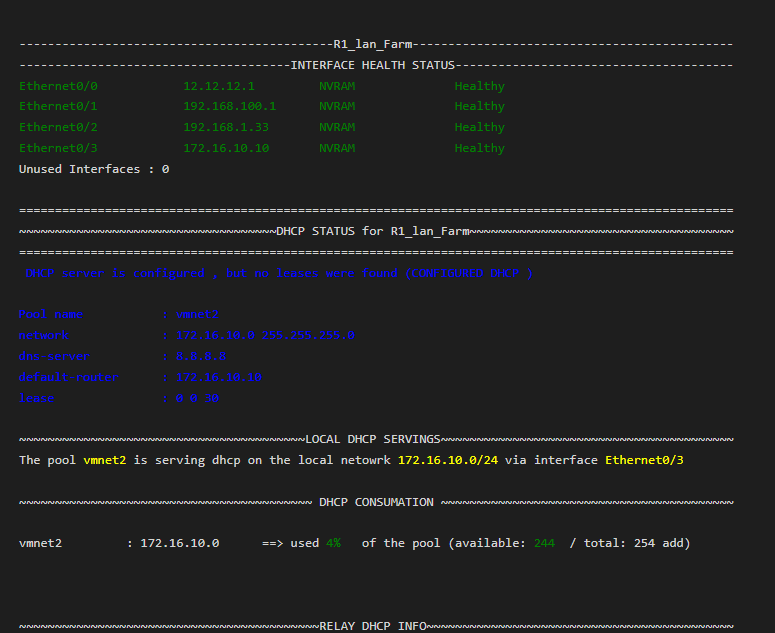
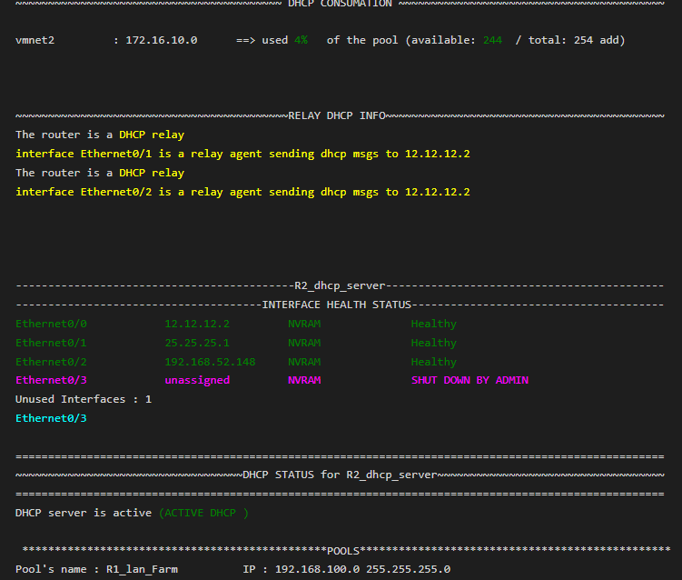
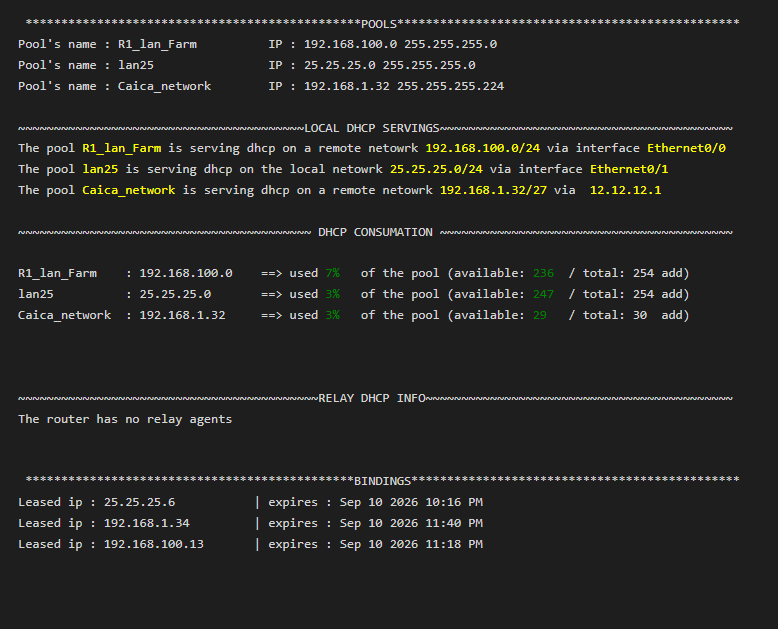

# Cisco DHCP & Network Health Auditor

An automated Python tool that audits Cisco IOS routers for DHCP pool utilization, interface health status, and network configuration analysis. Generates professional, color-coded HTML reports for network administrators.

## Features

- **Multi-Device Support**: Simultaneously audit multiple Cisco routers via SSH
- **DHCP Pool Utilization**: Calculate total, leased, excluded, and available IPs with custom subnet math
- **Interface Health Monitoring**: Detect physical issues, Layer 2 problems, admin-down interfaces, and unused ports
- **DHCP Relay Detection**: Identify relay agents and map local vs. remote DHCP serving
- **Automated Reporting**: Generate timestamped, color-coded HTML reports
- **Error Resilience**: Gracefully handles offline devices without crashing the entire audit

### Prerequisites
- Python 3.6+
- Cisco IOS devices with SSH enabled
- Network connectivity to target devices

### Installation

1. Clone this repository:
```bash
git clone https://github.com/abdelhak-walid/cisco-dhcp-auditor.git
cd cisco-dhcp-auditor
```
2. Install the required Python libraries:
```bash
pip install netmiko colorama
```

## Sample Output

The tool generates beautiful, color-coded reports. 





